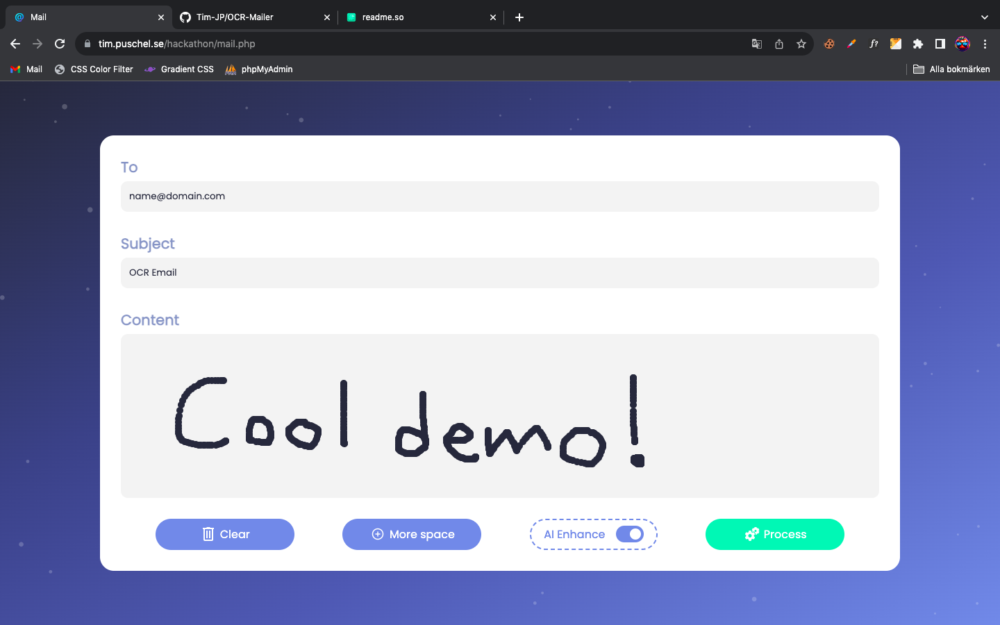
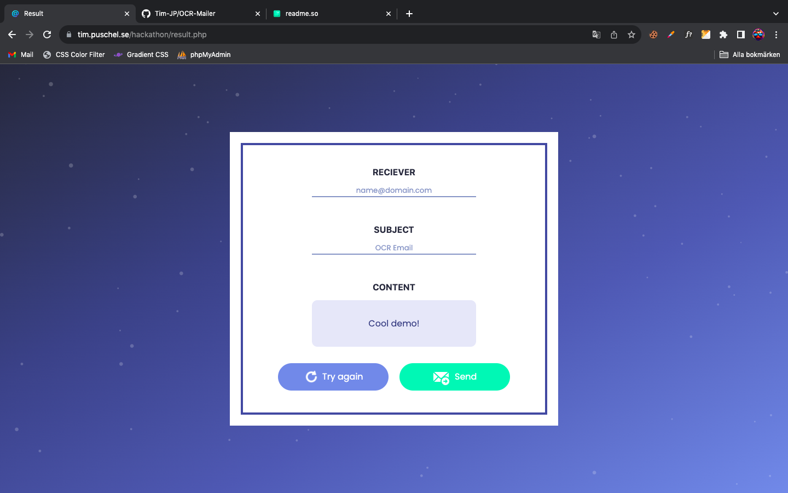

# OCR Mailer

This website makes you write your emails by hand. Which means using your mouse to draw in a box to generate your email content.

## Installation

You don't have to install anything. It's a website.

```bash
https://tim.puschel.se/hackathon/
```
    
## Tutorial

1. **Navigate website:**
* Click on the "Try it out" link.

   
2. **Write your email:** 
   
* Select a reciever and a subject. You can change this later.
* Draw in the content box. Simply press down and move your mouse to create a line. The slower you go the more connected the line will get.
* To create more space or start over, use the buttons "Clear" and "More space" in the bottom left.

   

3. **Submit mail:**

* When you're done, select if you want AI Enhance or not and proceed to click "Process". (AI Enhance corrects possible spelling mistakes or guesses poorly written text).

4. **Send email:**

* If everything looks correct, you can now click the "Send" button.
* If you aren't pleased with the result. Simply try again.

   

5. **You are all set:**

* This was everything you need to know. Good luck!

   

## Demo

Watch the demo video here. Nothing special about it.

```bash
https://youtu.be/1x49aXPyATE
```
